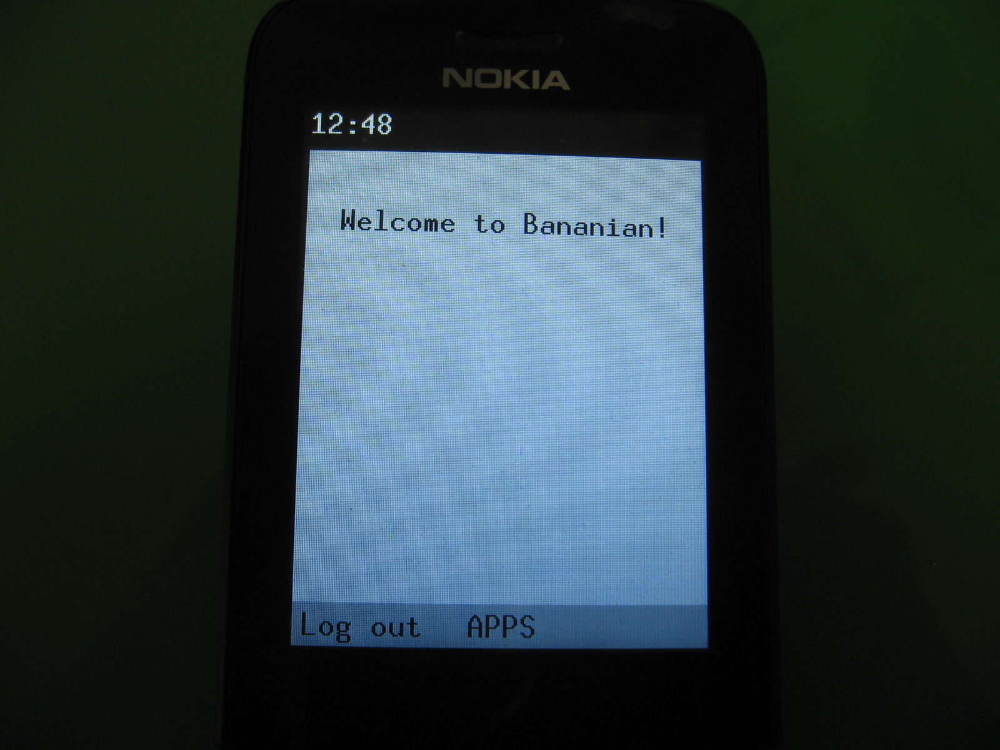

# Bananian - Debian for the Nokia 8110 4G and a UI

[How to build Bananian](#building)



## What is Bananian
Bananian is a custom installation of [Debian](https://debian.org) for the
Nokia 8110 4G (and possibly other Qualcomm-based feature phones).
This repository provides some scripts to build helpful packages and install the
system onto your phone.

## What Bananian is not

 - This is not a separate GNU/Linux distro: This is just a custom installation
   of Debian that uses Debian's package repositories with a few packages added
   on top.
 - Bananian is not a replacement for [KaiOS](https://kaiostech.com). However, it
   might become one later once it gets more supported features. It is currently
   meant to be installed side-by-side with KaiOS (into the recovery partition).

### Building
> **NOTE: This has been tested only on Debian GNU/Linux. Building on
> Debian-based
> distributions such as Ubuntu might work, but this will certainly not work on
> other operating systems.**

##### Additional system setup (only if you need to build packages from source)

First install pbuilder:
```
# apt install pbuilder
```

and set up the build chroot:
```
# pbuilder create --distribution bullseye
```

#### Starting the build

Then run `make menuconfig` and after that `make` as root
(Please make sure that nothing malicious happens).

To reconfigure, run `make menuconfig` again.
Other configurators are also available:
 - `config` (plain-text)
 - `nconfig` (new ncurses-based menuconfig alternative)
 - `xconfig` (qt-based, X11 front-end)
 - `gconfig` (gtk-based, X11 front-end)

##### Running system setup in QEMU
**QEMU mode is currently expermiental. It does not emulate the device or the
Bananian system. You probably don't need to use it, this section is included
just for reference.**
QEMU mode runs `debootstrap --second-stage` and various other setup commands in
the qemu-user emulator. The package qemu-user-static is required for this mode.
To enable it, append USE\_QEMU=1 to the make or make install-to-device command:

```
# make install-to-device USE_QEMU=1
```

#### Wireless networking
During the build process, you will be prompted to edit a file named
/etc/wpa\_supplicant.conf. In case you want to install manually, here is its
format:

```
network={
	ssid="[your network name]"
	psk="[your network password]"
}
```

### Installing
This step requires a **rooted** phone. See
[BananaHackers](https://sites.google.com/view/bananahackers/root) for more info.

Create two partitions on your SD card. Format the first one as FAT and the
second as EXT4.
Now you can run `make install-to-device` and it will install it automatically.
Alternatively, you can install Bananian manually:

Push boot.img to the phone and flash it to boot or recovery:

    (on your phone)
    # dd if=path/to/boot.img of=/dev/block/bootdevice/by-name/<boot or recovery>

Then insert the SD card into the phone, push the debroot.tar file and run the
following commands on your phone:

    cd /data
    mkdir debroot
    busybox mount /dev/block/mmcblk1p2 debroot
    cd debroot
    busybox tar xvf /path/to/debroot.tar
     (lots of output)
    (The following commands until 'exit' are only needed if QEMU mode was
    disabled.)
    mount -o bind /dev dev
    mount -o bind /sys sys
    mount -o bind /proc proc
    export PATH=/usr/local/sbin:/usr/sbin:/usr/local/bin:/usr/bin:$PATH
    chroot . /bin/bash
    debootstrap/debootstrap --second-stage
    cd var/cache
    dpkg -i bananui-base_0.0.1-armhf.deb device-startup_0.0.1-all.deb
    adduser user
     (enter data)
    adduser user sudo
    (These commands are always needed:)
    exit
    dd if=/path/to/boot.img" \
		"of=/dev/block/bootdevice/by-name/<recovery or boot> bs=2048
    <reboot recovery (or just reboot if you installed to `boot`)>

### Passwords

If you used the on-device bootstrap method, the password will be set to
the default value 'bananian'.
If you use the QEMU bootstrap method, the password will be set at build time.

### Shell access
To get shell access to your phone, find out its IP address via your router.
Then execute:

```
$ ssh user@X.X.X.X # Where X.X.X.X is your the phone's IP address
```

To get root access, use sudo.

### Window list
To show a list of open windows, press the power button with the slide open.

*This might not work if the phone was booted with the slide open. If the screen
turns off when pressing the power button, close the slide completely, open it
and try again.*

### Bugs
Please report an issue if you find a bug.

### Contribute
If you would like to contribute, you can always submit a merge request.
If you want to write an app, check out some of the existing apps and also the
[Protocol Documentation](https://affenull2345.gitlab.io/bananian/Bananui-Protocol.html).
### Kernel
See [KERNEL.md](KERNEL.md)

### Disclaimer
Install this ***at your own risk***! I am not responsible for bricked phones!

This installer is distributed in the hope that it will be useful,
but **WITHOUT ANY WARRANTY**; without even the implied warranty of
**MERCHANTABILITY** or **FITNESS FOR A PARTICULAR PURPOSE**.  See the
GNU General Public License for more details.
